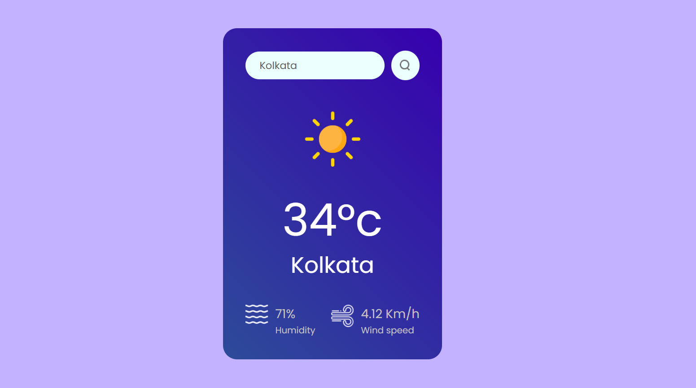

# 🌦 Weather App

A modern and responsive weather forecasting application built using React.js that provides real-time weather updates for any city worldwide.

🔗 Live Demo: https://weatherapp-mocha-eight.vercel.app/
📂 GitHub Repository: https://github.com/IvnasasSanvi/Weather-app

---

## 📸 Preview





---

# ✨ Features

* 🌍 Search weather by city name
* 🌡 Real-time temperature updates
* ☁ Weather conditions and icons
* 💨 Wind speed and humidity display
* 📱 Fully responsive design
* ⚡ Fast and smooth user experience

---

# 🏗 Tech Stack

## Frontend

* React.js
* HTML5
* CSS3
* JavaScript

---

# ⚙️ Installation

## Clone Repository

```bash
git clone https://github.com/IvnasasSanvi/Weather-app.git
```

## Navigate to Project

```bash
cd Weather-app
```

## Install Dependencies

```bash
npm install
```

## Start Development Server

```bash
npm run dev
```

---

# 📂 Project Structure

```bash
Weather-app/
│
├── src/
├── public/
├── package.json
└── README.md
```

---

# 🌍 Deployment

Frontend deployed on Vercel.

---

# 🎯 Future Improvements

* 7-day weather forecast
* Dark/Light mode
* Geolocation support
* Weather animations
* Hourly forecast charts

---

# 👨‍💻 Author

Made with ❤️ by SANVI

GitHub: https://github.com/IvnasasSanvi
